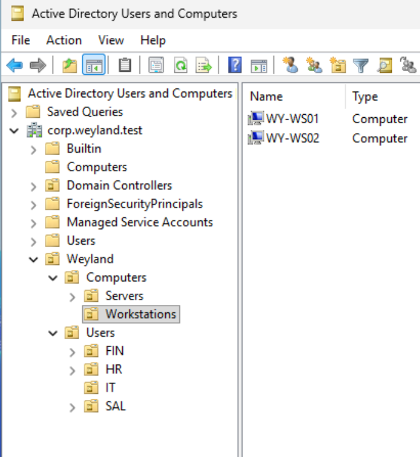
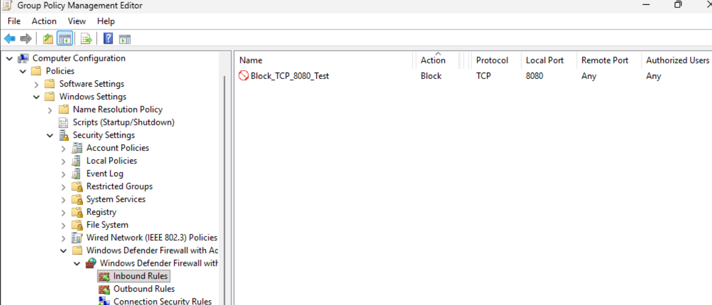
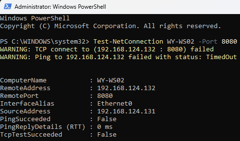

# windows-endpoint-security-lab
Windows endpoint deployment and security lab featuring Active Directory, Group Policy, Microsoft Defender, Windows Firewall, least privilege, Powershell automation, and endpoint troubleshooting.

## Project Overview

This project focuses on deploying and securing Windows 11 endpoints within an existing Active Directory domain.
Technologies used include VMware Workstation, Windows Server 2025, Windows 11 Pro, Active Directory, Microsoft Defender, PowerShell, Windows Firewall, and Spiceworks Cloud Help Desk.
The project is designed to demonstrate endpoint deployment, security hardening, automation, policy enforcement, validation, and troubleshooting in a simulated enterprise environment.

## Environment

### Domain
- **Organization:** Weyland Corporation
- **Domain:** `corp.weyland.test`

### System

| Hostname | Operating System | Role |
|----------|------------------|------|
| WY-DC01 | Windows Server 2025 | Domain Controller / DNS |
| WY-WS01 | Windows 11 Pro | Domain Workstation |
| WY-WS02 | Windows 11 Pro | Endpoint Deployment Workstation |

## Project Goals
- Deploy and manage Windows 11 endpoints in an Active Directory environment
- Implement centralized endpoint security policies
- Apply least-privilege administrative practices
- Configure and validate Microsoft Defender and Windows Firewall
- Automate endpoint inventory using Powershell
- Validate endpoint compliance
- Troubleshoot simulated endpoint incidents

## Endpoint Security Baseline

### Automatic Workstation Lock

Configured `Interactive logon: Machine inactivity limit` through Group Policy to enforce a 15-minute inactivity lock across managed Windows 11 endpoints.

### Microsoft Defender

Configured Microsoft Defender settings through `GPO_Endpoint_Security_Baseline` to ensure antivirus and real-time protection remain enabled on managed endpoints.

Validation was performed with PowerShell using `Get-MpComputerStatus`.

Verified on both workstations:
- `AMServiceEnabled = True`
- `AntivirusEnabled = True`
- `RealTimeProtectionEnabled = True`
- `AntispywareEnabled = True`

### Windows Firewall

Verified that Domain, Private, and Public Windows Firewall profiles were enabled on both managed endpoints using `Get-NetFirewallProfile`.

A controlled inbound firewall rule was then deployed through Group Policy to block TCP port `8080` on the Domain profile.

The rule was validated from `WY-WS01` using:

`Test-NetConnection WY-WS02 -Port 8080`

The connection test returned `TcpTestSucceeded : False`, confirming the firewall rule was actively blocking the traffic.

## Screenshots

### Domain-Managed Endpoints

### Firewall Block Rule

### Firewall Rule Validation

